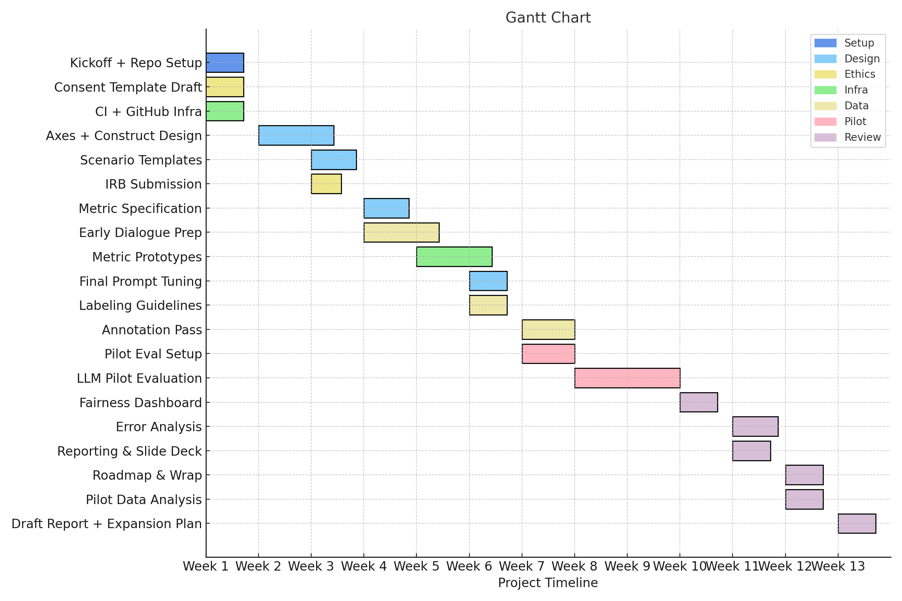

# EQ AI Research Hub

Welcome to the **EQ AI Research Hub**. We are committed to collaboratively developing, refining, and promoting standardized benchmarks for assessing emotional intelligence in artificial intelligence systems, anchored around the leading **SERA-X** model.

GitHub Discussions are enabled for open dialogue and interdisciplinary collaboration.

This website serves as the foundational resource and single source of truth for all project collaborators.

Status: *early scaffold* (v0.0.1) - layout may change

New to these terms? See the [Glossary](docs/glossary.md) for quick definitions.
Missing a term? Use the **Glossary term request** issue template to propose an addition.

## 1  Project Snapshot
SERA-X is intended to be a collaborative benchmark for evaluating emotional intelligence in AI systems. This repository collects design documents and sample datasets as they become available. Authorized visitors can log in on the project website and submit new sources or constructs directly through the provided forms. These entries are stored in our Supabase tables (`literature` and `constructs`) and mirrored JSON files under `data/`. For guidance, see [docs/persisting_constructs.md](docs/persisting_constructs.md) and the [Research Hub Contribution Guide](docs/quick_github_guide.md).

| Project Attribute | Short description |
|-------------------------|---------------------|
| **Goal** | Provide an open, reproducible framework that measures how well large-language models (and, later, multimodal systems) *sense*, *explain*, *respond* to, and *adapt* around human emotions. |
| **Status** | `v0.1-alpha` – folder skeleton, pilot metric stubs, and sample data only. |
| **Pilot window** | **Day 0 – Day 90** (see roadmap) |
| **Inspiration** | *Humanity’s-Last-Exam*, HELM, EQ-Bench, ETHOS, EmpatheticDialogues |
| **Lead org** | tentatively *Inflection AI* research group |
| **Contact** | placeholder: Max Parks, research lead maxaeonparks@gmail.com |

---

## 2  Why SERA-X?
Emotional intelligence in AI should not be judged by a single pass/fail label.  
We model it as four independent, graded skills, along with an extended perspective:

| Axis | Short description | Pilot metric (text-only) |
|------|-------------------|--------------------------|
| **Sense** | Detect user emotion from language | Macro-F1 on 10 emotion labels |
| **Explain** | Infer probable causes / appraisals | Cause-Inference Accuracy |
| **Respond** | Generate helpful, empathic replies | Human Empathy Score (HES 1-5) |
| **Adapt** | Retain performance on new cultures & slang | Δ-F1 across “Experience Packs” |
| **Extended** | Evaluates AI's performance across diverse human-AI interaction levels. | Composite score from multi-modal interaction assessments. |

### Theoretical Foundations
Underlying this interdisciplinary methodology are several Theoretical Foundations, essential to guiding and informing our approach to emotional intelligence assessment. These foundations provide crucial context and ensure conceptual coherence by defining the ethical considerations, methodological principles, and disciplinary frameworks that inform how emotional intelligence constructs are identified, understood, measured, and interpreted within the SERA-X project. Understanding these theoretical foundations is vital to appreciating the comprehensive, responsible, and rigorous nature of our emotional intelligence benchmarks.

| Theoretical Foundation | Brief Description | Disciplinary Origin | Primary Reference(s) | Role in Project |
| --- | --- | --- | --- | --- |
| Affective Computing | Computational methods for recognizing, interpreting, and simulating human emotions. | Computer Science | Picard, R. (1997). Affective Computing. MIT Press. | Provides computational models for sensing and interpreting emotion signals, shaping data collection and scoring rules for the Sense and Explain metrics. |
| Ethical AI Development | Normative principles and ethical frameworks guiding fair, inclusive, and responsible development of AI systems. | Ethics, Philosophy | Coeckelbergh (2020). AI Ethics. MIT Press. | Defines review protocols and fairness audits that shape the evaluation methodology and metrics across all axes. |
| Extended Mind | Cognition extends beyond the individual to include tools and environment. | Philosophy, Cognitive Science | Clark, A., & Chalmers, D. (1998). The Extended Mind. *Analysis.* | Grounds the "Extended" axis and shapes human–AI interaction metrics by framing the system and user as a single cognitive loop. |


---

## 3  Repository Layout
This repository is organized as an EQ AI Research Hub. Major sections include:

- [**Benchmarks/**](Benchmarks/) – details of the SERA-X benchmark and comparisons to alternative models (see [docs/alternative-models.html](docs/alternative-models.html)).
- [**Resources-and-Tools/**](Resources-and-Tools/) – datasets, scripts, and utilities for running EQ evaluations.
- [**Research-and-Publications/**](Research-and-Publications/) – links to papers and articles related to emotional intelligence benchmarking.
- [**Community-and-Collaboration/**](Community-and-Collaboration/) – information on participating via GitHub Discussions or chat channels.
- [**Contributor-Hub/**](Contributor-Hub/) – guidelines and Markdown templates for submitting new constructs, datasets, and publications.
- [**docs/ethics/**](docs/ethics/) – frameworks that guide responsible research.
- 🔗 [Ethics and Inclusivity Standards](docs/ethics/inclusivity.md)
- [**Outreach-and-Dissemination/**](Outreach-and-Dissemination/) – upcoming events and announcements.
- [**Visualizations/**](Visualizations/) – placeholders for interactive graphs.
- [**updates.md**](updates.md) – log of recent news and milestones.


---

## 4  Quick Start   *(developers)*

**Prerequisites:**
- Python ≥3.8
- Git
- virtualenv or venv

bash
git clone https://github.com/maxaeon/EQ-bench.git
cd EQ-bench
# No additional Python packages required yet
pytest               # tests not yet available

---

## 5 Quick Start (non-technical contributors)

**Prerequisites:**
- GitHub account
- Modern web browser

See the [Research Hub Contribution Guide](docs/quick_github_guide.md) for step-by-step screenshots.

For a short overview of how psychologists, philosophers, engineers, and other specialists can get involved, see [Community-and-Collaboration/ONBOARDING.md](Community-and-Collaboration/ONBOARDING.md).


---

### Project website

The `docs/` folder doubles as a GitHub Pages site.
Visit <https://maxaeon.github.io/EQ-bench/> for a short overview of the project and direct forms for submitting constructs or literature references. Entries submitted through these forms are stored in `data/construct_submissions.json` and `data/literature.json` and mirrored in our Supabase tables. See [docs/persisting_constructs.md](docs/persisting_constructs.md) and the [Research Hub Contribution Guide](docs/quick_github_guide.md) for details. Selected references can be downloaded as a BibTeX file. If you have a DOI, you can convert it to a BibTeX entry using online tools such as [bibtex.com](https://www.bibtex.com/c/doi-to-bibtex-converter/).
When exporting, extra fields such as the construct name, supported methodology, or SERA-X axis are omitted to keep the BibTeX file portable. Any keywords are written to the standard `keywords` tag and relevance notes appear under `note`. During import the site prompts for any missing required values.
For a walkthrough of the import/export buttons, see the [quick guide section on BibTeX files](docs/quick_github_guide.md#importing-and-exporting-bib-files).
The website also lets you rate how relevant each construct or paper is using a star widget.
The scale runs from **1 star = not relevant** to **5 stars = crucial**.

### Supabase integration
The website fetches data from Supabase. A small `env.js` file is created during deployment and loaded before `docs/script.js`:

```javascript
window.SUPABASE_URL = '<SUPABASE_URL>';
window.SUPABASE_ANON_KEY = '<SUPABASE_ANON_KEY>'; // public anon key
```

Store these values as GitHub repository secrets. The deployment workflow writes them into `docs/env.js` before publishing the site (see `.github/workflows/export_constructs.yml`). The GitHub documentation on [encrypted secrets](https://docs.github.com/en/actions/security-guides/encrypted-secrets) explains how to configure them. The keys are never committed to the repository. The site's CRUD functions require these values to access Supabase.

To require a simple password for editing when Supabase Auth is not used, define `window.DOC_PASSWORD` before loading `script.js`:

```javascript
window.DOC_PASSWORD = '<your editing password>';
```

When `SUPABASE_URL` and `SUPABASE_ANON_KEY` are provided, the site prompts for a Supabase email and password instead.

---

## 6 Contributing
We welcome pull requests, issues, and Discussions from developers, psychologists, ethicists, educators, and end-users.

Task type	How-to
Add literature insight	Fill a [docs/construct-sheet.md](docs/construct-sheet.md) using the template.
Suggest new metric	Open an Issue tagged enhancement, include formula & citation.
Code contribution	Branch feat/<area>/<short-desc> → PR → ensure CI passes.
Report bias or bug	Use Issue template Bug report, provide minimal repro.

Please read [CONTRIBUTING.md](CONTRIBUTING.md) and our [CODE_OF_CONDUCT.md](CODE_OF_CONDUCT.md) before contributing.
### Merging BibTeX references (maintainers)
Run the helper script after collecting new `.bib` citations:

```bash
python scripts/merge_bibtex.py path/to/references.bib
```

This updates `data/literature.json` and mirrors it to `docs/data/literature.json` after deduplicating entries by title and DOI.

To export the curated JSON back into a single BibTeX file run:

```bash
python scripts/export_bibtex.py references.bib
```

### Migrating JSON snapshots to Supabase
If you need to seed the Supabase tables from the versioned JSON files, run:

```bash
export SUPABASE_URL="https://pzmmgpzcnjhivkizcvpp.supabase.co"
export SUPABASE_SERVICE_KEY="<service role key>"
node scripts/upload_to_supabase.js
```

The script reads `data/construct_submissions.json` and `data/literature.json`,
inserting them into the `constructs` and `literature` tables respectively.

To generate CSV files for Supabase's bulk import tool instead of using the API,
run:

```bash
python scripts/json_to_csv.py
```

This writes `data/construct_submissions.csv` and `data/literature.csv` that can
be uploaded through the Supabase dashboard.


---
## 7 Roadmap (v0 → v1)

1. **M-1 (Weeks&nbsp;1–2)** — Literature briefs & construct sheets consolidated
2. **M-1 (Week&nbsp;3)** — Axes & pilot metrics frozen (`design_dossier_v1`)
3. **M-2** — Pilot data (≈300 dialogue turns) annotated & baselines published
4. **M-3** — Day-90 deliverables:
   - Pilot report (`reports/`)
   - Full-scale data-collection plan
   - System-card template
   - v0.2 tag
5. **Post-pilot** — Expand to multimodal clips; public leaderboard; “Experience Pack&nbsp;01”

<p align="center">
  
</p>

## License
- **Code, docs & sample data**: Provided for evaluation and internal research only.
Redistribution or commercial use is prohibited without written permission. See `LICENSE`, `docs/LICENSE_DOCS`, and `data/LICENSE_DATA` for details.
